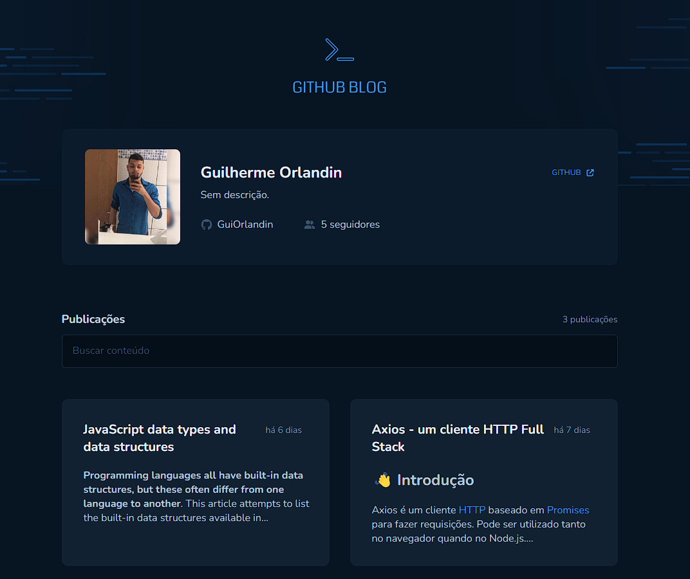
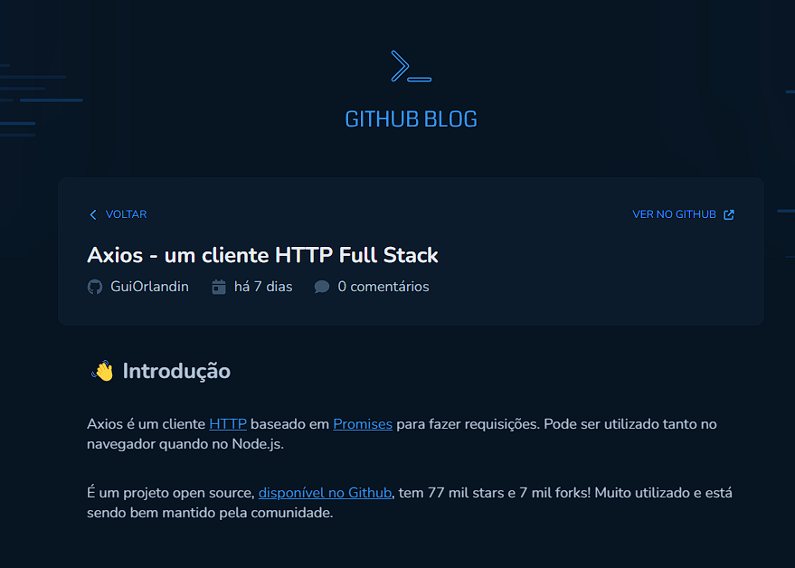
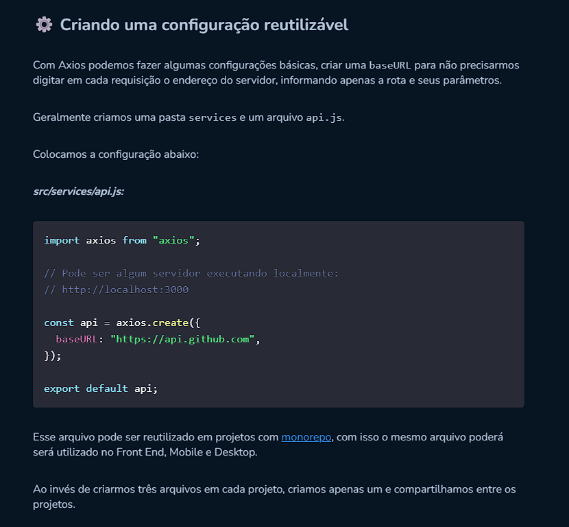

</div>

## ▶ Preview

[](github-blog-henna.vercel.app)

## 📃 About

Github blog, é um projeto que tem como o objetivo desenvolver uma aplicação que utilizará da API do GitHub para buscar issues de um repositório, dados do seu perfil e exibir elas como um blog

## 🎨 Layout

- [Layout Figma - Original](https://www.figma.com/community/file/1138814951106121051)

## 🛠 Build with

- [HTML]()
- [CSS]()
- [TypeScript]()

## 🎞 Demo





## 💻 Getting started

```sh
git clone https://github.com/GuiOrlandin/Github-Blog.git && cd 

Github-Blog
```

Download [live server](https://marketplace.visualstudio.com/items?itemName=ritwickdey.LiveServer) extension on vscode and run.